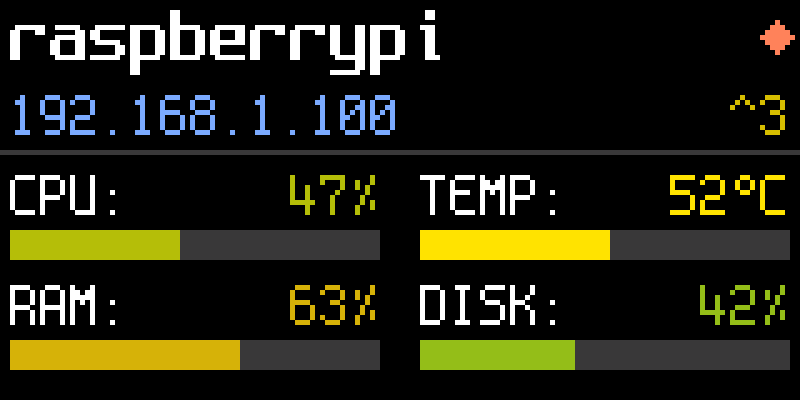
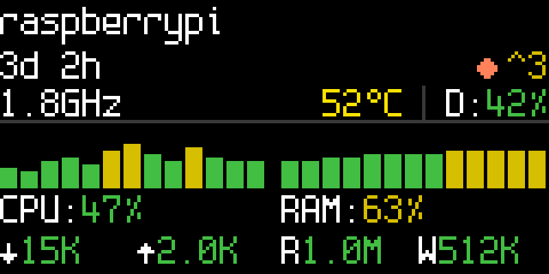

# UCTRONICS LCD Display Driver


Display driver for the [UCTRONICS Pi Rack Pro (RM0004)](https://www.uctronics.com/raspberry-pi/uctronics-pi-rack-pro-for-raspberry-pi-4b-19-1u-rack-mount-support-for-4-2-5-ssds.html) 160x80 ST7735 TFT LCD on Raspberry Pi 4/5. Shows live system metrics: CPU, RAM, temperature, disk, and network.

| Dashboard | Sparkline |
|:---------:|:---------:|
|  |  |

## Screens

**Dashboard** — single-page status view with color-coded bars for CPU, RAM, temperature, and disk usage.

**Sparkline** — scrolling history charts for CPU and RAM, plus live network and disk I/O rates, temperature, frequency, and alert badges.

**Diagnostic** — multi-page detailed metrics that alternate each refresh cycle: system overview (hostname, IPs, CPU, temperature, RAM) and I/O (disk, network, IOPS, update status).

## Installation

```bash
curl -sL https://github.com/cafedomingo/SKU_RM0004/releases/latest/download/install.sh | sudo bash
```

The script is idempotent — it handles both first install and updates. On first run it configures I2C, GPIO shutdown, and installs a systemd service. On subsequent runs it downloads the latest binary and restarts the service.

## Configuration

No configuration is required — sensible defaults are built in. Optional runtime settings in `/etc/uctronics-display.conf`:

```ini
screen=dashboard    # dashboard | diagnostic | sparkline
refresh=5           # 2-30 seconds
temp_unit=C         # C | F
```

Changes take effect immediately — no restart needed.

## Building from source

```bash
go build -o display ./cmd/display
```

Cross-compile for Pi:

```bash
GOOS=linux GOARCH=arm64 go build -o display ./cmd/display
```

## Development

Run tests:

```bash
go test ./...
```

Generate font data:

```bash
go generate ./internal/font/
```

Generate screenshots:

```bash
go build -o screenshot ./cmd/screenshot && ./screenshot
```

## Credits

For the original C display driver, see [UCTRONICS/SKU_RM0004](https://github.com/UCTRONICS/SKU_RM0004).

Spleen font by Frederic Cambus (BSD 2-Clause).