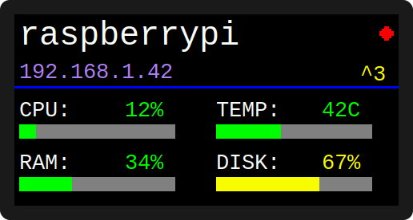

# UCTRONICS LCD Display Driver

Display driver for the [UCTRONICS SKU_RM0004](https://github.com/UCTRONICS/SKU_RM0004) 160x80 ST7735 TFT LCD on Raspberry Pi 4/5. Forked from the original and simplified to focus on the all-in-one status view.



- Hostname and auto-detected IP address
- CPU, RAM, temperature, and disk usage with color-coded bars
- DietPi update indicator (◆) and APT upgrade count (^N)
- Refreshes every 5 seconds

## Install

```bash
git clone https://github.com/cafedomingo/SKU_RM0004.git
cd SKU_RM0004
sudo ./deployment_service.sh
```

This compiles the binary, installs a systemd service, configures I2C, and prompts for a reboot.

## Update

For devices already running the service:

```bash
curl -sL https://github.com/cafedomingo/SKU_RM0004/releases/latest/download/update.sh | sudo bash
```

Or build from source:

```bash
cd /opt/uctronics-lcd
sudo git pull
sudo make clean && sudo make
sudo systemctl restart uctronics-display.service
```

## Uninstall

```bash
sudo systemctl disable uctronics-display.service
sudo rm /etc/systemd/system/uctronics-display.service
sudo systemctl daemon-reload
```

## Configuration

Settings are in `hardware/rpiInfo/rpiInfo.h`. Rebuild after changing.

```c
#define TEMPERATURE_TYPE  CELSIUS    // or FAHRENHEIT
#define REFRESH_INTERVAL_SECS  5     // seconds between updates
```
